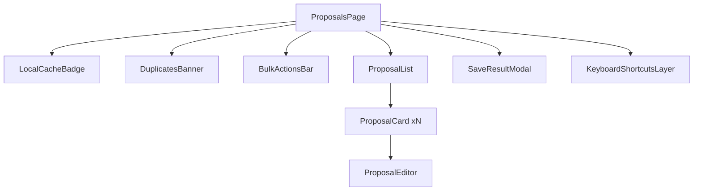

# Plan implementacji widoku Proposals (Przegląd propozycji)

## 1. Przegląd

Widok Proposals prezentuje listę propozycji fiszek wygenerowanych przez AI, umożliwia akcje per pozycja (akceptuj, edytuj, usuń), akcje hurtowe (zapisz zaakceptowane, zapisz wszystkie, odrzuć wszystkie, zaznacz/odznacz wszystkie), walidację limitów znaków i zapis batchowy zaakceptowanych pozycji do backendu z idempotencją. Stan sesji propozycji jest przechowywany w LocalStorage z TTL 24 h i przywracany po odświeżeniu. Widok jest dostępny wyłącznie dla zalogowanych.

## 2. Routing widoku

np- Ochrona: `AuthGuard` (tylko zalogowani; przy 401/bez sesji — redirect do `/auth/login` z powrotem do intencji).

- Wejścia na widok:
  - Po zakończeniu generacji w `/generate` (sekcja w tym samym ekranie).
  - Po odświeżeniu strony — przywrócenie sesji z LocalStorage, o ile TTL nie wygasł.

## 3. Struktura komponentów

- `ProposalsPage`
  - `LocalCacheBadge`
  - `DuplicatesBanner`
  - `BulkActionsBar`
  - `ProposalList`
    - wiele `ProposalCard`
      - opcjonalnie `ProposalEditor` (modal/inline)
  - `SaveResultModal`
  - `KeyboardShortcutsLayer`

Drzewo komponentów (wysokopoziomowe):

## 4. Szczegóły komponentów

### ProposalsPage

- Opis: Kontener widoku. Ładuje/przywraca stan sesji, orkiestruje akcje, integruje API zapisu, zarządza idempotencyjnością i redirectami po sukcesie.
- Główne elementy: nagłówek, `LocalCacheBadge`, `DuplicatesBanner`, `BulkActionsBar`, `ProposalList`, `SaveResultModal`.
- Obsługiwane interakcje:
  - Inicjalizacja sesji z LocalStorage (TTL) lub z Generate.
  - Wywołania: Zapis zaakceptowanych, Zapis wszystkich, Odrzuć wszystkie.
  - Obsługa 401/422/409/503/429 i offline.
- Walidacja:
  - Blokada akcji zapis/zbiorowych do czasu `session.done === true`.
  - Blokada zapisu, gdy w zaakceptowanych są błędy walidacji treści.
  - Offline: blokada zapisu, tooltip/baner.
- Typy: `ProposalsSessionVM`, `ProposalVM`, `FlashcardBatchSaveRequest`, `FlashcardBatchSaveResponse`.
- Propsy: brak (widok routowany). Zależności z hooków: `useProposalsSession`, `useIdempotencyKey`, `useKeyboardShortcuts`.

### LocalCacheBadge

- Opis: Informuje o przywróceniu stanu z cache oraz o pozostałym TTL.
- Główne elementy: chip/badge z czasem do wygaśnięcia; przycisk „Wyczyść”.
- Zdarzenia: klik „Wyczyść cache” → `session.clear()` i odświeżenie widoku.
- Walidacja: brak (logika prezentacyjna; ukryj, gdy brak cache lub po zapisie).
- Typy: `TTLInfo` (pozostałe ms/ISO).
- Propsy: `{ ttlInfo?: TTLInfo; onClear: () => void }`.

### DuplicatesBanner

- Opis: Prezentuje wynik `skipped` po zapisie (np. duplikaty) z możliwością rozwinięcia listy.
- Elementy: alert/banner, licznik `skipped.length`, lista frontów z `reason` po rozwinięciu.
- Zdarzenia: zamknięcie/ukrycie.
- Walidacja: renderuj tylko jeśli `saveResult.skipped.length > 0`.
- Typy: `FlashcardBatchSaveSkippedItem[]`.
- Propsy: `{ skipped: FlashcardBatchSaveSkippedItem[] }`.

### BulkActionsBar

- Opis: Pasek akcji hurtowych i statusu selekcji.
- Elementy: `Checkbox` „Zaznacz wszystkie”, przyciski: `Zapisz zaakceptowane`, `Zapisz wszystkie`, `Odrzuć wszystkie` (danger), licznik zaznaczonych/zaakceptowanych/odebranych.
- Zdarzenia:
  - Toggle zaznaczenia wszystkich.
  - Zapis zaakceptowanych → emit `onSaveAccepted()`.
  - Zapis wszystkich → emit `onSaveAll()`.
  - Odrzuć wszystkie → emit `onRejectAll()`.
- Walidacja:
  - Disabled, gdy `!session.done` lub `isOffline`.
  - `Zapisz zaakceptowane` disabled, gdy brak zaakceptowanych.
  - `Zapisz wszystkie` dostępne zawsze (po `done`), ale przy zapisie walidujemy.
- Typy: liczniki i flagi z `ProposalsSessionVM`.
- Propsy: `{ counts, disabledFlags, onSaveAccepted, onSaveAll, onRejectAll, onToggleSelectAll }`.

### ProposalList

- Opis: Lista kart propozycji z progressive reveal (skeletony → elementy) i blokadą akcji do `done`.
- Elementy: placeholder skeletony, wiersze `ProposalCard`. Paginy brak (batch ≤50).
- Zdarzenia: przekazuje w dół zdarzenia akcji per-karta, obsługuje klawiaturę/fokus.
- Walidacja: renderuj stany błędów przy pozycjach z błędami treści.
- Typy: `ProposalVM[]`.
- Propsy: `{ items, done, onItemChange, onDeleteItem }`.

### ProposalCard

- Opis: Pojedyncza propozycja z polami front/back, licznikami znaków, akcjami Accept/Edit/Delete, checkbox selekcji.
- Elementy: `Textarea` front/back (readonly do czasu wejścia w tryb edycji), liczniki, przyciski: Accept, Edit, Delete; `Checkbox` zaznaczenia.
- Zdarzenia: `onAccept`, `onEditStart`, `onEditSave`, `onEditCancel`, `onDelete`, `onToggleSelect`.
- Walidacja:
  - Front ≤ 200 znaków, Back ≤ 500 znaków (grapheme-safe) — przy edycji i przed `Accept`.
  - Blokada Accept, jeśli walidacja nie przechodzi.
  - Oznaczenie `source=ai_edited` po zapisaniu edycji.
- Typy: `ProposalVM`, `ValidationErrors`.
- Propsy: `{ item: ProposalVM, disabled: boolean, onChange: (updated) => void, onDelete: () => void }`.

### ProposalEditor (modal/inline)

- Opis: Edytor treści propozycji (inline lub w `Dialog`). Na zapis — auto-accept i `source=ai_edited`.
- Elementy: `Dialog`/sekcja inline, `Textarea` front/back z licznikami, przyciski Zapisz/Anuluj.
- Zdarzenia: `onSave(updated)`, `onCancel()`.
- Walidacja: front/back jak wyżej; liczniki i komunikaty błędów.
- Typy: `ProposalVM`, `ValidationErrors`.
- Propsy: `{ item, isOpen, onSave, onCancel }`.

### SaveResultModal

- Opis: Modal sukcesu po batch-save z CTA „Idź do nauki”.
- Elementy: liczby `saved/skipped`, lista skrótowa `skipped`, przyciski `Zamknij`, `Idź do nauki`.
- Zdarzenia: `onClose`, `onGoToStudy()` → nawigacja do `/study`.
- Walidacja: renderuj tylko po sukcesie 201.
- Typy: `FlashcardBatchSaveResponse`.
- Propsy: `{ result?: FlashcardBatchSaveResponse, onGoToStudy }`.

### KeyboardShortcutsLayer

- Opis: Warstwa nasłuchująca skrótów klawiatury (Enter = Accept; `e` = Edit; `Del` = Delete; modyfikatory dla akcji hurtowych; `Ctrl+A` = zaznacz wszystkie).
- Elementy: niewizualne; opcjonalnie legenda w tooltipie/bannnerze.
- Zdarzenia: wywołuje przekazane callbacki.
- Walidacja: aktywne tylko przy `done===true` i gdy fokus jest w obrębie listy.
- Typy: brak specyficznych poza handlerami.
- Propsy: `{ handlers, enabled }`.

## 5. Typy

- Wykorzystanie istniejących z `src/types.ts`:
  - `FlashcardBatchSaveRequest`, `FlashcardBatchSaveResponse`, `FlashcardBatchSaveItem`, `FlashcardBatchSaveSkippedItem`, `UUID`.

- Nowe typy ViewModel (tylko FE):
  - `type ProposalStatus = 'pending' | 'accepted' | 'edited' | 'deleted'`
  - `interface ValidationErrors { front?: string; back?: string }`
  - `interface ProposalVM { id: string; front: string; back: string; status: ProposalStatus; selected: boolean; sourceCandidate: Extract<FlashcardBatchSaveItem['source'], 'ai' | 'ai_edited'>; errors?: ValidationErrors; frontCount: number; backCount: number }`
  - `interface ProposalsSessionVM { requestId: UUID; requestedMax: number; receivedCount: number; done: boolean; items: ProposalVM[]; createdAt: string; ttlExpiresAt: string; }`
  - `interface SaveState { loading: boolean; error?: string; result?: FlashcardBatchSaveResponse }`
  - `interface TTLInfo { expiresAt: string; remainingMs: number }`

Walidacja długości: `frontCount ≤ 200`, `backCount ≤ 500` (grapheme-safe liczenie po stronie FE).

## 6. Zarządzanie stanem

- Lokalny stan w `ProposalsPage` (React 19): `useReducer` dla `ProposalsSessionVM` + `useState` dla `SaveState`.
- Custom hooki:
  - `useProposalsSession()`
    - Cel: źródło prawdy o sesji propozycji; integruje LocalStorage TTL (24 h) pod kluczem `proposals.session.v1`.
    - API: `{ session, replaceFromGenerate(batch), markAccepted(id), markEdited(id, front, back), delete(id), toggleSelect(id), toggleSelectAll(), rejectAll(), counts, done, persist(), clear() }`.
  - `useIdempotencyKey(session.requestId)`
    - Cel: zapewnić stabilny `Idempotency-Key` per sesja; przechowywać w LocalStorage do czasu sukcesu.
  - `useKeyboardShortcuts(handlers, enabled)`
    - Cel: skróty klawiaturowe kontekstowe.
  - `useValidation()`
    - Cel: obliczanie grapheme-safe liczników i błędów; helpery `validateProposal`/`validateMany`.
- Offline detection: globalny `NetworkBanner` + `navigator.onLine`/`online|offline` events.

## 7. Integracja API

- Endpoint: `POST /api/flashcards:batch-save`
- Nagłówki: `Content-Type: application/json`, `Idempotency-Key: <UUID>`.
- Typ żądania: `FlashcardBatchSaveRequest` (`{ items: Array<{ front, back, source: 'ai'|'ai_edited' }> }`).
- Budowanie payloadu:
  - `acceptedItems = items.filter(status in ['accepted','edited'])`;
  - `source = status==='edited' ? 'ai_edited' : 'ai'`.
- Typ odpowiedzi (201): `FlashcardBatchSaveResponse` (`{ saved: [{id,source}], skipped: [{front,reason}] }`).
- Mapowanie błędów:
  - `401` → wymuś logowanie, zachowaj sesję; po sukcesie wróć i dokończ.
  - `422` → wskaż pozycje z błędami (front/back > limity) i zablokuj zapis do czasu poprawy.
  - `409` → pokaż `DuplicatesBanner` z `skipped`; nie traktować jako fail całości.
  - `429/503/500` → toast z opcją ponów; sesja pozostaje nienaruszona.
- Klient HTTP: `src/lib/http.ts` (jeśli dostępny) lub `fetch` z obsługą JSON i mapowaniem błędów.

## 8. Interakcje użytkownika

- Per karta:
  - Accept: oznacza kartę jako zaakceptowaną (status `accepted`), jeśli walidacja ok.
  - Edit: otwiera `ProposalEditor`; na „Zapisz” aktualizuje treść, oznacza `status='edited'` oraz `sourceCandidate='ai_edited'` i auto-accept.
  - Delete: usuwa kartę z sesji (status `deleted` lub faktyczne usunięcie z listy).
  - Toggle select: zmienia pole `selected` (dla skrótów/akcji hurtowych).
- Hurtowe:
  - Zaznacz/odznacz wszystkie: toggluje `selected` wszystkich widocznych pozycji.
  - Zapisz zaakceptowane: wysyła tylko `accepted|edited`.
  - Zapisz wszystkie: najpierw automatycznie oznacza wszystkie jako `accepted` (poza usuniętymi), następnie zapisuje.
  - Odrzuć wszystkie: czyści sesję i LocalStorage.
- Po zapisie (201):
  - Pokaz `SaveResultModal` z liczbami i CTA „Idź do nauki”.
  - LocalStorage sesji jest czyszczony; idempotency key zużyty.
  - Opcjonalny redirect do `/study` na CTA.
- Skróty klawiatury: `Enter=Accept`, `e=Edit`, `Del=Delete`, `Ctrl+A=Zaznacz wszystkie`, modyfikatory (np. `Shift+Enter` = Accept zaznaczone).

## 9. Warunki i walidacja

- Limity treści: `front ≤ 200`, `back ≤ 500` (zgodnie z PRD i API). Walidacja przy edycji, przed Accept i przed zapisem.
- Akcje zablokowane do `session.done === true` (koniec batcha generacji).
- Offline → zapisy zablokowane; tooltip/baner informacyjny.
- 0 propozycji → `BulkActionsBar` pokazuje disabled akcje zapisu; CTA do `/generate`.
- Idempotencja: jeden `Idempotency-Key` na sesję; ponowne wysłanie zwraca identyczny wynik.

## 10. Obsługa błędów

- 401 unauthorized: zachowaj stan; pokaż modal/logowanie; po zalogowaniu ponów zapis.
- 422 validation_failed: podświetl pola i komunikaty; blokuj zapis dopóki błędy nie znikną.
- 409 conflict (duplikaty): renderuj `DuplicatesBanner` z listą `skipped`; sukces częściowy.
- 429 too_many_requests: toast + backoff; przycisk „Spróbuj ponownie”.
- 503 upstream_unavailable / 500: toast/bannery; nie czyść sesji.
- TTL wygasł: banner informacyjny; zaproponuj powrót do `/generate`.

## 11. Kroki implementacji

1. Routing: dodaj chronioną trasę `/proposals` (Astro + React), użyj `AuthGuard`.
2. Struktura katalogów: `src/components/proposals/` (Page, List, Card, Editor, Bars/Badges, Modals, hooks).
3. Typy FE: dodaj definicje `ProposalVM`, `ProposalsSessionVM`, `ValidationErrors` w module widoku.
4. Hook `useProposalsSession`: implementuj stan, operacje na pozycjach, LocalStorage TTL (24 h), import batcha z `/generate`.
5. Hook `useValidation`: liczenie graphemów i reguły limitów; integracja z Card/Editor.
6. Hook `useIdempotencyKey`: generowanie/persist klucza na podstawie `requestId` sesji.
7. UI komponenty: zaimplementuj `LocalCacheBadge`, `DuplicatesBanner`, `BulkActionsBar`, `ProposalList`, `ProposalCard`, `ProposalEditor`, `SaveResultModal`, `KeyboardShortcutsLayer` (Shadcn/ui + Tailwind 4).
8. Integracja API: funkcja `saveBatch(items, key)` z nagłówkiem `Idempotency-Key`; mapowanie odpowiedzi i błędów.
9. Blokady i stany: zaimplementuj disabled/tooltipy dla `!done`, offline, braku zaakceptowanych.
10. Skróty klawiaturowe: podłącz `useKeyboardShortcuts` z handlerami; dodaj tooltip z listą skrótów.
11. Telemetria (server-side): upewnij się, że FE nie duplikuje eventów (brak dodatkowego `POST /api/events` w tym widoku, chyba że wymagane oddzielnie przez produkt).
12. QA manualne: walidacje treści, akcje hurtowe, 401→login→retry, 409 duplikaty (skipped), idempotencja (ponowny zapis), TTL cache, offline.
13. Testy e2e/smoke: przypadki podstawowe (zapis zaakceptowanych, zapis wszystkich, odrzucenie wszystkich, edycja → `ai_edited`).
